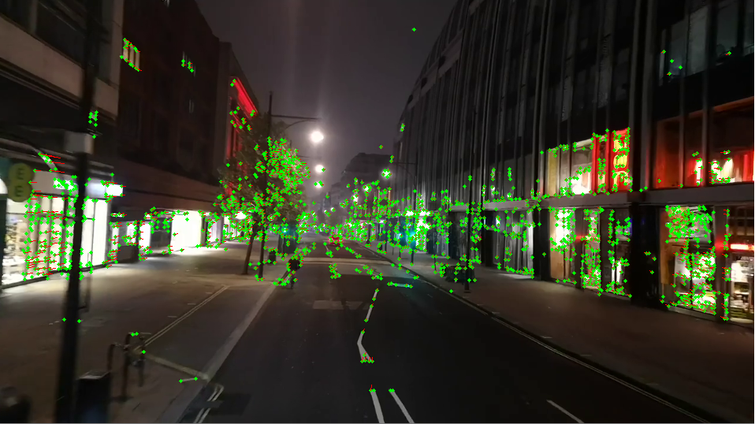
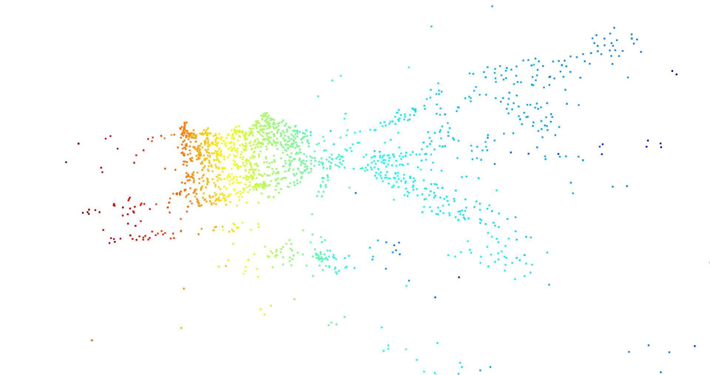

# SLAM

### point cloud using open3d

### point cloud using matplotlib

## Libraries used
* [OpenCV](https://opencv.org/)
* [NumPy](https://numpy.org/)
* [Open3D](http://www.open3d.org/)
* [matlotlib](https://matplotlib.org/)

## TODO
* make point cloud in real-time (no  frame by framy)
* better optimization
